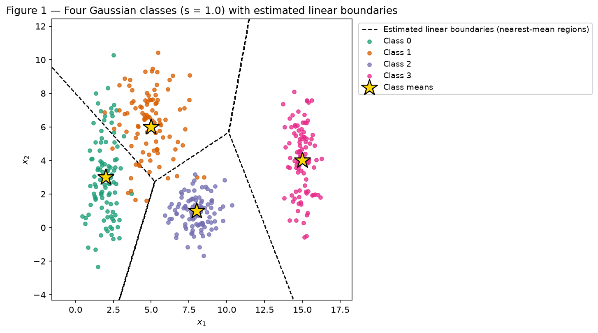
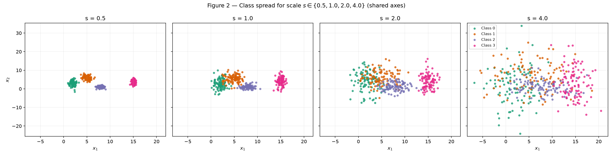
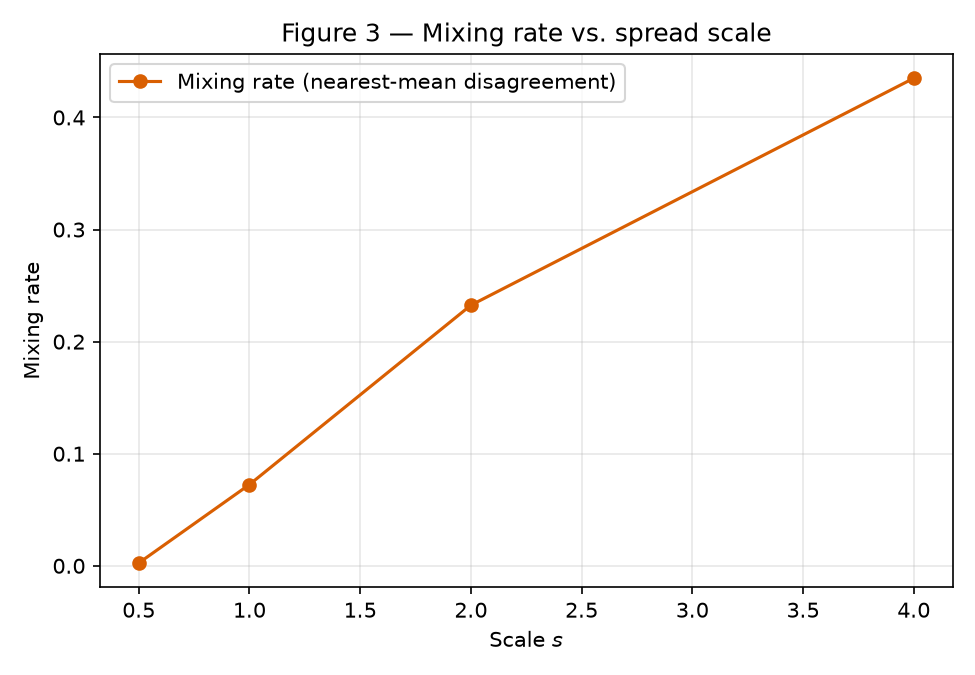
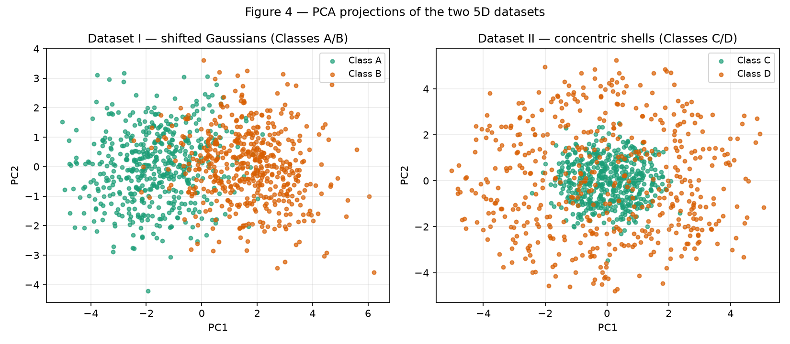
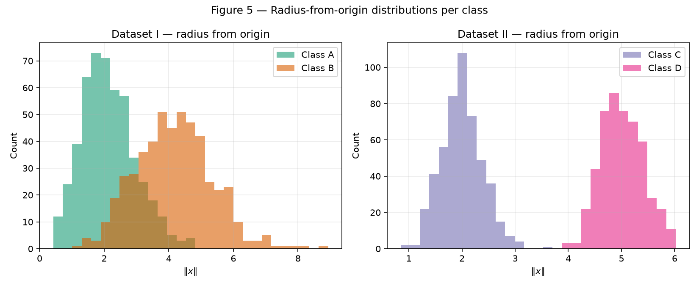
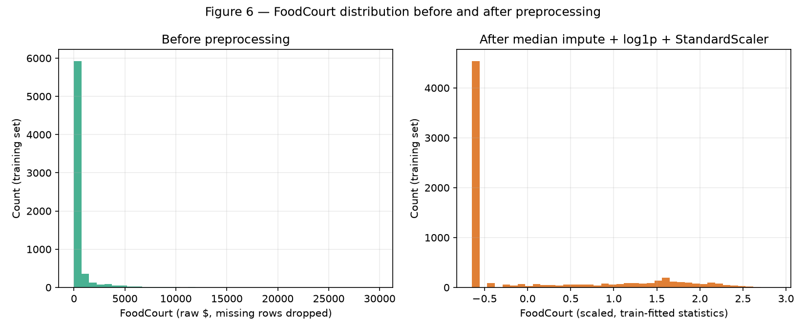

# Data Preparation and Analysis for Neural Networks

!!! abstract "Enunciado"

    [Exercises → Data](https://insper.github.io/ann-dl/2026.2/exercises/data/){:target='_blank'}

All synthetic data in Exercises 1 and 2 is generated by a single
`numpy.random.default_rng(42)` instance, created once and reused for every draw across both
exercises, in the order shown below — it is never re-created or reset. The full script is
[`code/exercise1_2_synthetic_data.py`](https://github.com/Thaisrs165/ann-dl-2026-2/blob/main/docs/exercises/data/code/exercise1_2_synthetic_data.py);
the snippets below are extracts from it, included via `--8<--` so the report and the
repository never drift apart.

## Exercise 1

### A — Generate the clouds

**Approach.** Four 2D Gaussian classes (100 points each, 400 total) are drawn with the means
and standard deviations given in the assignment. Each of the two features is sampled
independently with `rng.normal(mean, std, size=100)`, so the covariance of every class is
diagonal — there is no assumed correlation between \(x_1\) and \(x_2\).

``` { .python .copy .select linenums='1' title="docs/exercises/data/code/exercise1_2_synthetic_data.py" }
--8<-- "docs/exercises/data/code/exercise1_2_synthetic_data.py:ex1-a"
```

**Figure 1** also sketches the boundaries that a simple multiclass linear classifier would
learn. Since a single straight line only separates two half-planes, it cannot carve four
class regions out of the plane. Instead, Figure 1 shows the boundaries produced by a
*nearest-mean* rule: every point on a fine grid is assigned to the class of its closest fixed
mean (Euclidean distance), which is exactly the decision rule of a linear multiclass
classifier of the form \(\arg\min_k \lVert x - \mu_k \rVert\). Because that rule reduces to
comparing linear functions of \(x\), the boundary between any two adjacent regions is a straight
line (the perpendicular bisector of the two means), and the four regions together form a
piecewise-linear partition of the plane — a set of linear boundaries, not one line.


/// caption
**Figure 1** — Scatter of the 400 points (100 per class) at `s = 1.0`, with the four class
means marked as gold stars and the estimated linear decision boundaries (dashed) of a
nearest-mean classifier overlaid. Boundaries and means use markers and colors distinct from
the observations so the three layers cannot be confused.
///

At `s = 1.0`, Classes 0 (mean \((2,3)\)) and 1 (mean \((5,6)\)) visibly overlap in Figure 1: their
clouds interleave near \(x_1 \approx 3\)–\(5\), which is exactly the pair with the smallest
separation ratio measured in part B (\(r_{01} = 1.3258\), see the table below). Classes 2 and 3
are comparatively isolated at this scale. The boundaries in Figure 1 are the nearest-mean
regions described above — they do not come from a trained classifier (none was fit for this
report), they are a deterministic function of the four fixed means and are shown only to
illustrate what a piecewise-linear decision rule looks like on this geometry.

### B — More or less spread out

**Approach.** Four datasets are generated with the same means and `scales = [0.5, 1.0, 2.0,
4.0]` multiplying every class standard deviation; the means never change. All four draws
continue consuming the same `rng` used in part A.

``` { .python .copy .select linenums='1' title="docs/exercises/data/code/exercise1_2_synthetic_data.py" }
--8<-- "docs/exercises/data/code/exercise1_2_synthetic_data.py:ex1-b"
```


/// caption
**Figure 2** — The same four classes at `s = 0.5, 1.0, 2.0, 4.0`, one subplot per scale, all
sharing axis limits computed from the combined data of all four scales so that the growth of
the clouds is directly comparable.
///

**Pairwise separation ratios at `s = 1.0`.** Using \(\bar{\sigma}_k = (\sigma_{k,x} +
\sigma_{k,y})/2\) computed from the class standard deviations (not resampled from the data):
\(\bar{\sigma}_0 = 1.65\), \(\bar{\sigma}_1 = 1.55\), \(\bar{\sigma}_2 = 0.90\), \(\bar{\sigma}_3 = 1.25\).

Center distance is \(\lVert\mu_i-\mu_j\rVert\), combined average spread is
\(\bar{\sigma}_i+\bar{\sigma}_j\), and their quotient is the separation ratio \(r_{ij}\).

| Pair | Center distance \(\lVert\mu_i-\mu_j\rVert\) | Combined average spread \(\bar{\sigma}_i+\bar{\sigma}_j\) | Separation ratio \(r_{ij}\) |
|---|---:|---:|---:|
| (0, 1) | 4.2426 | 3.20 | **1.3258** |
| (1, 2) | 6.7082 | 2.45 | 2.3800 |
| (0, 2) | 6.7082 | 2.55 | 2.4802 |
| (2, 3) | 7.6158 | 2.15 | 3.5422 |
| (1, 3) | 10.1980 | 2.80 | 3.6422 |
| (0, 3) | 13.0380 | 2.90 | 4.4960 |

The smallest ratio is \(r_{01} = 1.3258\), between Classes 0 and 1 — the two closest, most
similarly-spread classes, consistent with the overlap seen in Figure 1. Since every distance
in the numerator is fixed and every \(\bar{\sigma}\) in the denominator scales linearly with \(s\),
\(r_{ij}(s) = r_{ij}(1)/s\); without regenerating any data, the smallest ratio at \(s = 2.0\) is
\(1.3258 / 2 = 0.6629\).

**Mixing rate.** For each scale, every point's Euclidean distance to all four *fixed* means
(the same means used in Figure 1, never recomputed per scale) is measured, the point is
assigned to its nearest mean, and the mixing rate is the fraction of points whose nearest-mean
label disagrees with the true generating label:

| Scale \(s\) | Mixing rate |
|:---:|---:|
| 0.5 | 0.0025 |
| 1.0 | 0.0725 |
| 2.0 | 0.2325 |
| 4.0 | 0.4350 |


/// caption
**Figure 3** — Fraction of points misassigned by the nearest-mean rule, plotted against
`scale`. The rate grows from 0.25% at `s = 0.5` to 43.5% at `s = 4.0`.
///

**Where separation breaks down.** At `s = 0.5` the clouds in Figure 2 are compact and nearly
disjoint (mixing rate 0.25%): straight boundaries separate them almost perfectly on this
sample. At `s = 1.0` the smallest ratio is already close to 1 (\(r_{01} = 1.33\)) and Classes 0
and 1 visibly interleave, though the mixing rate is still low (7.25%) because the other three
pairs remain well separated. By `s = 2.0` the smallest ratio drops to 0.66 (below 1, meaning
the gap between the closest means is now smaller than their combined average spread) and the
mixing rate rises sharply to 23.25%: Figure 2's third panel shows Classes 0, 1, and 2
overlapping in a shared central region that no straight boundary can cleanly split. At `s =
4.0` the mixing rate reaches 43.5% — close to the roughly 75% a random 4-way guess would
average — and Figure 2's last panel shows all four clouds merged into one smear. Based on
Figure 2, the mixing rates, and the separation ratio, `s = 2.0` is the point at which this
particular sample can no longer be cleanly separated with straight boundaries; this describes
the empirical, plotted separation of this specific 400-point draw, not a proof that no linear
separator exists in the underlying distributions.

### C — Analysis

- **Overlap at `s = 1`.** Classes 0 and 1 already overlap substantially (separation ratio
  \(r_{01} = 1.3258\), the smallest of the six pairs), while Classes 2 and 3 remain visually
  distinct from the rest (their smallest ratios to any other class, \(r_{12}=2.38\) and
  \(r_{23}=3.54\), are both well above 2). The mixing rate at `s = 1` is still low overall,
  7.25%, because it averages over all four classes.
- **One boundary vs. a set of boundaries.** A single binary decision line partitions the plane
  into exactly two half-planes, so it can separate at most two classes from each other. With
  four classes, at least three linear boundaries are needed to carve out four regions, one per
  class — which is exactly what the nearest-mean rule in Figure 1 produces: a piecewise-linear
  partition made of straight segments, not a single line.
- **Boundaries in Figure 1.** The dashed lines are the perpendicular bisectors between
  neighboring class means under the nearest-mean rule \(\arg\min_k \lVert x-\mu_k\rVert\). They
  are drawn from a purely geometric computation on the four fixed means, not from any trained
  classifier, and are visually distinguished (black dashed lines vs. colored dots vs. gold
  stars) so they cannot be mistaken for data or for the means themselves.
- **Growing spread and unavoidable errors.** As `scale` increases, each class's own spread
  grows faster than the fixed distances between means, so the regions of feature space where
  two or more classes have comparable density (the "ambiguous regions") expand. Because the
  supports of the Gaussians always overlap by some (shrinking) amount, some errors become
  unavoidable for any boundary, straight or curved, once the spread is large enough relative
  to the gaps between means.
- **Ratio and mixing rate move together.** As `s` grows from 0.5 to 4.0 the separation ratio
  for every pair shrinks by the same factor \(1/s\) (so the smallest ratio falls from 2.65 at
  s=0.5 to 0.33 at s=4.0), while the mixing rate climbs monotonically from 0.25% to 43.5%. The
  two measurements describe the same geometric effect — the average class spread growing
  relative to the fixed distances between means — from two different angles: one purely from
  the generating parameters, the other from actually simulating a nearest-mean classifier on
  sampled points.

## Exercise 2

### A — Dataset I: shifted Gaussians

**Approach.** Class A (\(N=500\)) is drawn from a 5D multivariate normal centered at the origin
with the given correlated covariance `sigma_a`; Class B (\(N=500\)) is drawn from a second
multivariate normal centered at \((1.5,\dots,1.5)\) with a different covariance `sigma_b`. Both
draws use `rng.multivariate_normal`, continuing the same `rng` from Exercise 1.

``` { .python .copy .select linenums='1' title="docs/exercises/data/code/exercise1_2_synthetic_data.py" }
--8<-- "docs/exercises/data/code/exercise1_2_synthetic_data.py:ex2-a"
```

### B — Dataset II: concentric shells

**Approach.** Class C and Class D (\(N=500\) each) are built by first drawing a 5D standard
normal vector, normalizing it to a unit-length direction, then scaling that direction by a
radius drawn from \(\text{Normal}(2.0, 0.4)\) for Class C or \(\text{Normal}(5.0, 0.4)\) for Class
D. The result is two roughly spherical shells centered at the origin with different, mostly
non-overlapping radii.

``` { .python .copy .select linenums='1' title="docs/exercises/data/code/exercise1_2_synthetic_data.py" }
--8<-- "docs/exercises/data/code/exercise1_2_synthetic_data.py:ex2-b"
```

### C — Visualize and compare

**Approach.** A separate 2-component `sklearn.decomposition.PCA` is fit to each dataset (one
fit on Dataset I's 1000 points, one on Dataset II's 1000 points) purely for visualization; no
classifier is trained. Class centers, the Euclidean distance between the two centers per
dataset, and every observation's radius from the origin are also computed directly in the
original 5D space.

``` { .python .copy .select linenums='1' title="docs/exercises/data/code/exercise1_2_synthetic_data.py" }
--8<-- "docs/exercises/data/code/exercise1_2_synthetic_data.py:ex2-c"
```


/// caption
**Figure 4** — Left: Dataset I (Classes A/B) projected onto its own first two principal
components, PC1 + PC2 explained variance = 0.5135 + 0.1588 = **0.6723**. Right: Dataset II
(Classes C/D) projected onto its own first two principal components, PC1 + PC2 explained
variance = 0.2164 + 0.2147 = **0.4310**.
///


/// caption
**Figure 5** — Left: Dataset I, radius \(\lVert x \rVert\) from the origin, Class A vs. Class B,
common bins. Right: Dataset II, radius from the origin, Class C vs. Class D, common bins. The
two classes in Dataset II barely overlap in radius even though their centers are nearly
coincident.
///

**Class centers and distances (original 5D space).** Distance between centers, Dataset I
(A vs. B): **3.4053**. Distance between centers, Dataset II (C vs. D): **0.2347**. Mean radius
from the origin: Class C = 2.0071, Class D = 5.0101 (matching the generating parameters 2.0
and 5.0 closely, as expected with 500 samples each).

**Which PCA projection preserves classification-relevant information?** Dataset I's PCA
projection (Figure 4, left) visibly separates Classes A and B along PC1, and captures a larger
total variance (67.23%) — here, the direction of maximum variance happens to roughly align
with the direction that also separates the classes, since the two class means are shifted
apart along a fixed direction. Dataset II's PCA projection (Figure 4, right) shows Classes C
and D almost fully overlapping, and captures markedly less total variance (43.10%) split
almost evenly between PC1 and PC2. This is expected because Dataset II's structure is radial
(the class label depends on \(\lVert x \rVert\), not on direction), while PCA looks only for the
linear directions of maximum variance — it has no mechanism to prefer a rotationally symmetric
"distance from center" feature over any other linear combination, so the class-defining signal
does not concentrate in the top two components. Total variance preservation and preservation
of a nonlinear, radial class structure are therefore two different things: Dataset I shows a
case where they happen to coincide, and Dataset II shows a case where they do not.

### D — Analysis

- **Nearly coincident centers, separated radii.** Dataset II's two class centers are only
  0.2347 apart in 5D — an order of magnitude closer than Dataset I's 3.4053 — yet the two
  classes are built from clearly separated radius distributions (mean 2.0071 vs. 5.0101, with
  essentially non-overlapping histograms in Figure 5). Center distance alone is therefore not
  a reliable summary of how separable two classes are: Dataset II is much more separable than
  its center distance suggests, precisely because its structure is radial rather than
  directional.
- **No hyperplane can enclose a sphere.** A hyperplane \(w^\top x + b = 0\) splits space into
  two unbounded half-spaces. Class C occupies a spherical shell around the origin — a bounded
  region surrounded on every side by Class D. Any single hyperplane that puts all of Class C on
  one side necessarily also puts an entire unbounded half-space of directions from Class D on
  that same side, so it cannot simultaneously keep all of Class D on the other side. This is a
  topological property of "an enclosed region vs. its surrounding shell," not a matter of
  sample size or noise.
- **More data reveals, but does not create, linear separability.** Collecting more than 500
  samples per class would make the radius histograms in Figure 5 smoother and the shells more
  clearly delineated, but the underlying geometry — a bounded region surrounded by another
  class in every direction — does not change with sample size. More data sharpens the picture
  of an inherently non-linear boundary; it does not turn that boundary into a hyperplane.
- **PCA overlap does not prove inseparability.** PCA is a *linear*, lossy projection chosen to
  maximize captured variance, not class separation. Figure 4 showing Classes C and D
  overlapping in the top two principal components only shows that the two directions of
  largest variance do not align with the (radial, nonlinear) feature that actually separates
  the classes. It says nothing conclusive about separability in the original 5D space — as
  confirmed directly below by the radial rule, which does separate the classes almost
  perfectly using information PCA does not project onto its first two axes.
- **A radial separation rule.** The feature \(f(x) = \sum_{i=1}^5 x_i^2 = \lVert x \rVert^2\)
  is nonlinear in \(x\) but converts the radial structure into a simple threshold problem. Using
  the observed mean radii (Class C: 2.0071, Class D: 5.0101), a reasonable threshold sits at
  their midpoint, \(\approx 3.5086\), i.e. \(f(x) \approx 12.3102\): classify as Class C when
  \(f(x) < 12.31\) and Class D otherwise. No classifier is trained to obtain this threshold — it
  is read directly off the generating/observed radius distributions in Figure 5, where the two
  histograms leave a visible gap around this value.

## Exercise 3

The Spaceship Titanic labeled `train.csv` is not committed to this repository (Kaggle's
competition terms prohibit redistribution) — see the note at the end of this report for
where to place it locally. All of Exercise 3 is produced by
[`code/exercise3_spaceship_titanic.py`](https://github.com/Thaisrs165/ann-dl-2026-2/blob/main/docs/exercises/data/code/exercise3_spaceship_titanic.py),
included below by section.

### A — Get to know the data

**Approach.** `Transported` indicates whether a passenger was pulled into another dimension
when the *Spaceship Titanic* collided with the spacetime anomaly — it is the binary target
for this dataset. The script below loads the raw 8693-row `train.csv`, reports the class
balance, lists which features are numerical vs. categorical, counts missing values per
column, and summarizes the five spending columns.

``` { .python .copy .select linenums='1' title="docs/exercises/data/code/exercise3_spaceship_titanic.py" }
--8<-- "docs/exercises/data/code/exercise3_spaceship_titanic.py:ex3-a"
```

**Class balance.** `Transported = True`: 4378 (50.36%); `Transported = False`: 4315
(49.64%). Positive-class share: **0.5036** — the classes are essentially balanced.

**Feature lists.** Numerical: `Age`, `RoomService`, `FoodCourt`, `ShoppingMall`, `Spa`,
`VRDeck`. Categorical (retained and encoded): `HomePlanet`, `CryoSleep`, `Destination`,
`VIP`. Identifiers/free text (dropped in part C): `PassengerId`, `Cabin`, `Name`. These 13
feature columns plus the `Transported` target account for every column in the CSV — no
other columns remain to classify.

**Missing values** (count / % of 8693 rows): `PassengerId` 0 (0.0%), `HomePlanet` 201
(2.31%), `CryoSleep` 217 (2.50%), `Cabin` 199 (2.29%), `Destination` 182 (2.09%), `Age` 179
(2.06%), `VIP` 203 (2.34%), `RoomService` 181 (2.08%), `FoodCourt` 183 (2.11%),
`ShoppingMall` 208 (2.39%), `Spa` 183 (2.11%), `VRDeck` 188 (2.16%), `Name` 200 (2.30%),
`Transported` 0 (0.0%). Missingness is spread fairly evenly across columns, around 2–2.5%
each, with no column standing out as far more incomplete than the others.

**Spending columns — mean / median / max** (full labeled data):

| Column | Mean | Median | Max |
|---|---:|---:|---:|
| RoomService | 224.69 | 0.00 | 14327.00 |
| FoodCourt | 458.08 | 0.00 | 29813.00 |
| ShoppingMall | 173.73 | 0.00 | 23492.00 |
| Spa | 311.14 | 0.00 | 22408.00 |
| VRDeck | 304.85 | 0.00 | 24133.00 |

Every one of the five columns has a median of exactly 0.00 (most passengers spend nothing
in a given category) while its mean is in the hundreds and its maximum reaches into the
tens of thousands. A mean that is hundreds of times its median, next to a maximum many
orders of magnitude above that mean, is the signature of a right-skewed, heavy-tailed
distribution: most values sit at or near zero, and a small number of passengers spend
extremely large amounts, pulling the mean far above the typical (median) value.

### B — Split before you transform

**Approach.** Features and target are separated first, then split with `test_size=0.20`,
`stratify=y`, `random_state=42` — before any imputer, encoder, or scaler is fit.

``` { .python .copy .select linenums='1' title="docs/exercises/data/code/exercise3_spaceship_titanic.py" }
--8<-- "docs/exercises/data/code/exercise3_spaceship_titanic.py:ex3-b"
```

**Data leakage.** If a statistic used to transform the data — an imputation median, a
scaler's mean/standard deviation, or the set of categories an encoder knows about — is
computed from the full dataset before splitting, information from the test set leaks into
training: the model is then evaluated on data that already influenced its preprocessing,
which inflates the apparent performance relative to what the model would achieve on truly
unseen data. Splitting first and fitting every transformer on the training subset only
avoids this.

Resulting sizes: **6954** training rows, **1739** test rows (80.00% / 20.00% of 8693,
matching `test_size=0.20`). FoodCourt on the training subset, before any transforming:
mean = **452.6112**, median = **0.0000** — close to, but not identical to, the full-dataset
statistics in part A, as expected from a random 80% subsample.

### C — Preprocess

**Approach.** `PassengerId`, `Cabin`, and `Name` are dropped. `Age` and the five spending
columns are median-imputed (fit on the training subset); `TotalSpend` is then computed as
the sum of the five *imputed, un-logged* spending values, and `np.log1p` is applied to the
five spending columns and to `TotalSpend` alike, giving 7 numerical features in total. Those
7 features are standardized with a `StandardScaler` fit on the training subset.
`HomePlanet`, `CryoSleep`, `Destination`, and `VIP` are most-frequent-imputed and one-hot
encoded with `OneHotEncoder(handle_unknown="ignore", sparse_output=False)`, again fit only
on the training subset (this repository's scikit-learn is 1.9.1, which uses the
`sparse_output` argument natively — no compatibility shim was needed). The final matrices
horizontally stack the scaled numeric block and the one-hot categorical block.

``` { .python .copy .select linenums='1' title="docs/exercises/data/code/exercise3_spaceship_titanic.py" }
--8<-- "docs/exercises/data/code/exercise3_spaceship_titanic.py:ex3-c"
```

`TotalSpend` is deliberately built from the imputed *original* dollar amounts before any
`log1p` is applied — summing already-logged values would not equal `log1p` of the true
total, since `log1p` is not additive.

**`handle_unknown="ignore"`.** If the test subset contains a category value that the
encoder never saw while fitting on the training subset, the encoder does not raise an
error: it encodes that observation as all zeros across every one-hot column belonging to
that original feature, instead of activating one of them. The observation is not dropped —
it simply carries no signal for that particular categorical feature.

**Results.** Final training feature-matrix shape: **(6954, 17)** (7 numeric + 10 one-hot
columns, from 3 `HomePlanet` categories + 2 `CryoSleep` + 3 `Destination` + 2 `VIP`). Final
test feature-matrix shape: **(1739, 17)**. Remaining `NaN` count: **0** in both matrices.
Global min/max, training data: **−1.9961 / 3.5080**. Global min/max, test data: **−1.9961 /
3.3687**.

Standardization centers each numeric feature near 0 with unit variance *on the training
set*, but nothing about `StandardScaler` guarantees every value lands inside \([-1, 1]\) — a
value more than one standard deviation from the mean will fall outside that range, which is
exactly what the matrix-wide max above (3.51 on train) shows. What standardization does
guarantee is a common, roughly zero-centered scale across features, which keeps a `tanh`
unit's input in the range where its gradient is not already flat, reducing (without fully
eliminating) the risk of saturation compared to leaving spending amounts in raw dollars,
where values in the thousands would immediately push `tanh` to \(\pm 1\) with essentially
zero gradient.

### D — Verify and visualize

``` { .python .copy .select linenums='1' title="docs/exercises/data/code/exercise3_spaceship_titanic.py" }
--8<-- "docs/exercises/data/code/exercise3_spaceship_titanic.py:ex3-d"
```


/// caption
**Figure 6** — Left: raw training-set `FoodCourt` values (missing rows dropped for the
histogram only), heavily concentrated at 0 with a long right tail out to ~30000. Right: the
same training-set column after median imputation, `log1p`, and `StandardScaler` (fit on the
training set), now spanning roughly −2 to 3.5 with the zero-spending spike still visible as
the leftmost bar but no longer dominating the axis.
///

**Verification.**

- Training and test matrices contain **0** `NaN` values each (confirmed above).
- Final shapes: training **(6954, 17)**, test **(1739, 17)**.
- Value ranges: training **[−1.9961, 3.5080]**, test **[−1.9961, 3.3687]** — both centered
  near 0 with no extreme outliers remaining, unlike the raw spending columns whose maxima
  reached into the tens of thousands.
- This scale suits a `tanh`-activated network because `tanh` saturates (gradient →0) for
  inputs far from 0; feeding it raw dollar amounts in the thousands would saturate it on
  nearly every non-zero spending observation, while the standardized, log-compressed inputs
  here stay within a few units of 0 for the large majority of rows.

**Reflection.** Two preprocessing decisions are most likely to affect training: the
`log1p` compression of the five heavy-tailed spending columns (and of `TotalSpend`), and
the subsequent standardization. Without `log1p`, a handful of passengers with spending in
the tens of thousands of dollars would sit many standard deviations away from the bulk of
the (mostly zero-spending) population after scaling — those extreme values would dominate
the loss gradient for whichever weights touch those features and would push `tanh` units
toward saturation on those rows, slowing or destabilizing optimization. Compressing the
tail with `log1p` before scaling brings the extreme spenders back into a range comparable
to everyone else, so the optimizer sees a much better-conditioned input distribution and
`tanh` activations are far less likely to sit in their flat, near-zero-gradient regions.

## Results summary

|  # | Item                                                                    | Your value |
| -: | ------------------------------------------------------------------------| ---------- |
|  1 | Mixing rate at \(s=0.5\)                                                  | 0.0025 |
|  2 | Mixing rate at \(s=1.0\)                                                  | 0.0725 |
|  3 | Mixing rate at \(s=2.0\)                                                  | 0.2325 |
|  4 | Mixing rate at \(s=4.0\)                                                  | 0.4350 |
|  5 | Smallest \(r_{ij}\) at \(s=1.0\), and which pair                            | 1.3258, pair (0, 1) |
|  6 | Distance between centers — Dataset I                                    | 3.4053 |
|  7 | Distance between centers — Dataset II                                   | 0.2347 |
|  8 | Explained variance PC1 + PC2 — Dataset I                                | 0.6723 |
|  9 | Explained variance PC1 + PC2 — Dataset II                               | 0.4310 |
| 10 | Share of the positive class in `Transported`                            | 0.5036 |
| 11 | Mean and median of `FoodCourt` on the training set, before transforming | 452.61 / 0.00 |
| 12 | Final shape of the training feature matrix                              | (6954, 17) |
| 13 | Minimum and maximum of the training and test sets after scaling         | Train: −1.9961 / 3.5080 — Test: −1.9961 / 3.3687 |

!!! note "Reproducing Exercise 3"

    The competition's labeled `train.csv` is **not** committed to this repository (Kaggle's
    terms prohibit redistribution). To reproduce Exercise 3, place it locally at
    `docs/exercises/data/spaceship-titanic/train.csv` (gitignored) and re-run
    `code/exercise3_spaceship_titanic.py`.

!!! info "AI-Use"

    ChatGPT and Claude were used to help interpret the assignment requirements,
    develop and debug the Python code, generate and review the visualizations,
    organize the report, and revise the written explanations. I reviewed the
    final submission with the assistance of these explanations to understand
    the methods and results presented.
