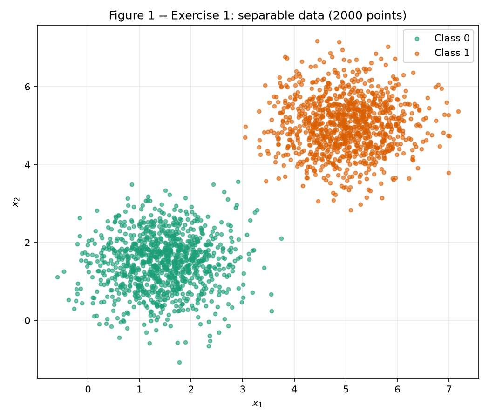
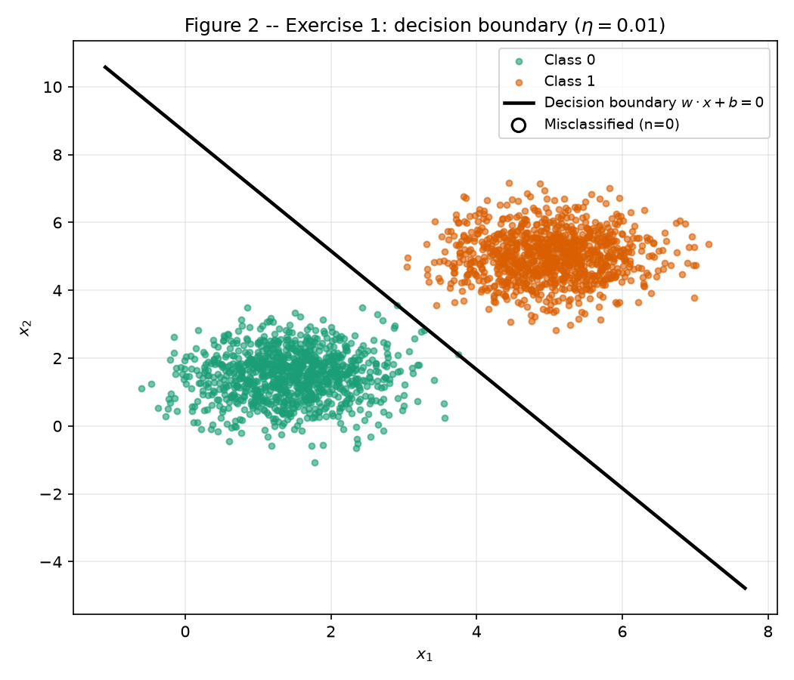
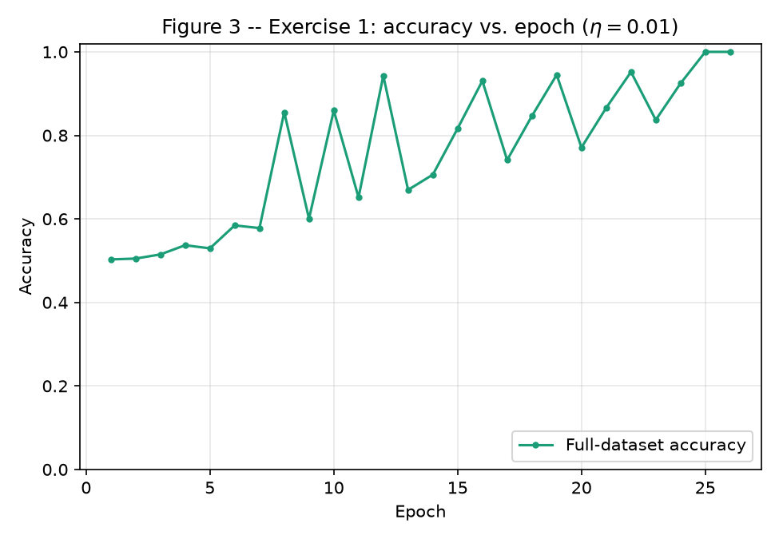
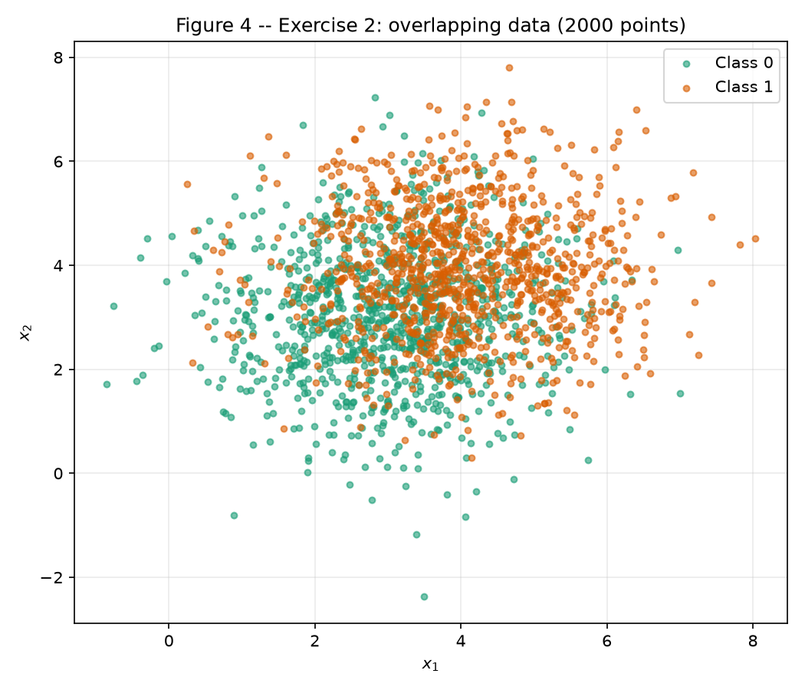
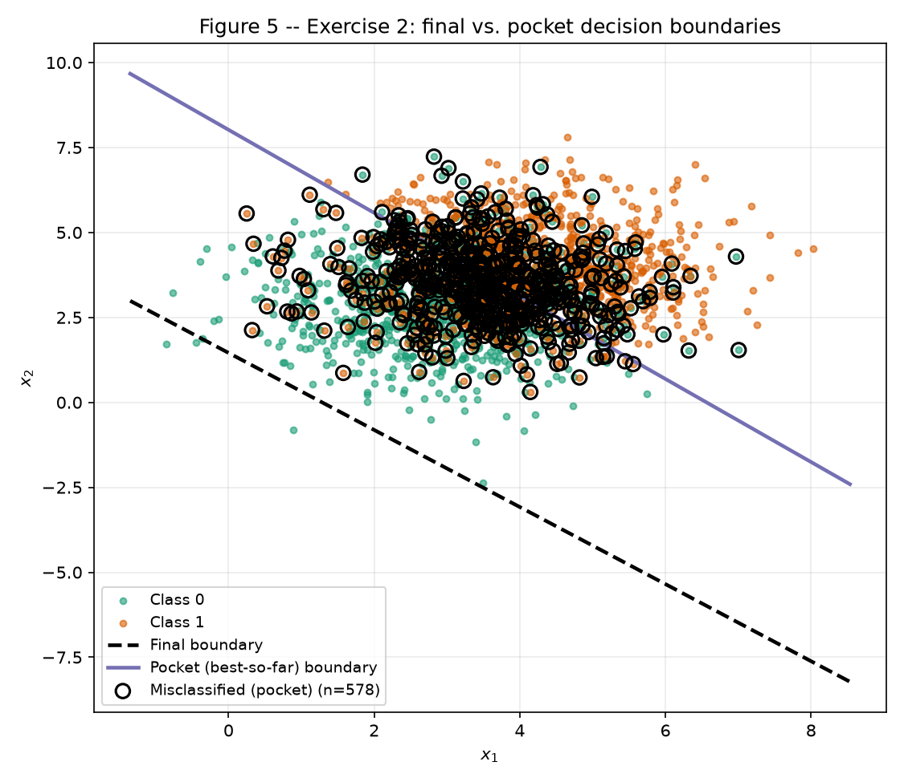
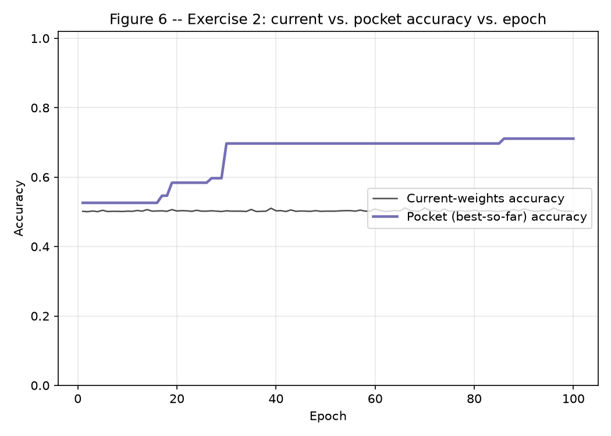

# Perceptron

!!! abstract "Assignment"

    [Exercises → Perceptron](https://insper.github.io/ann-dl/2026.2/exercises/perceptron/){:target='_blank'}

**Implementation approach.** A single `numpy.random.default_rng(42)` instance is created once
and reused for every draw across both exercises, in the order shown below: Exercise 1's two
classes, then Exercise 1's initial weights (kept unchanged for the `η = 1.0` rerun in D2), then
Exercise 2's two classes, then Exercise 2's initial weights. The perceptron itself — `step`,
`predict`, and the online training loop in `train_perceptron` — is written from scratch in
plain `numpy`; no scikit-learn model, optimizer, or `fit` call is used anywhere in this report.
Exercise 2 reuses that same function unchanged, passing `track_pocket=True`, which is the only
addition to the loop, as required. The main challenge was keeping the two `η` runs in Exercise
1D genuinely comparable: re-drawing fresh random weights for the `η = 1.0` run would have
confounded the effect of `η` with a different random start, so the same initial `(w, b)` drawn
for the `η = 0.01` run is passed explicitly into the `η = 1.0` run instead of drawing again.
The full script is
[`code/exercise1_2_perceptron.py`](https://github.com/Thaisrs165/ann-dl-2026-2/blob/main/docs/exercises/perceptron/code/exercise1_2_perceptron.py);
the snippets below are extracts from it, included via `--8<--` so the report and the repository
never drift apart.

This assignment's labels and predictions both live in `{0, 1}` (the assignment is explicit that
this is *not* the `{-1, +1}` textbook convention some perceptron write-ups use), so
`step(z) = 1` if `z ≥ 0` else `0`, and the update error `e = y - ŷ` takes values in `{-1, 0, 1}`.

## Exercise 1

### Separable Data: the case the perceptron was designed for

### A — Generate the data

**Approach.** 1000 points for Class 0 (`mean = [1.5, 1.5]`, `cov = [[0.5, 0], [0, 0.5]]`) and
1000 for Class 1 (`mean = [5, 5]`, `cov = [[0.5, 0], [0, 0.5]]`) are drawn with
`rng.multivariate_normal`, continuing the shared `rng`.

``` { .python .copy .select linenums='1' }
--8<-- "docs/exercises/perceptron/code/exercise1_2_perceptron.py:ex1-a"
```


/// caption
**Figure 1 —** The 2000 points of Exercise 1 (1000 per class). The Euclidean distance between
the means, \(\lVert(5,5)-(1.5,1.5)\rVert \approx 4.95\), is roughly 7 times the per-axis standard
deviation \(\sqrt{0.5}\approx0.71\), so the two clouds are essentially non-overlapping — exactly
what the assignment describes as "linearly separable with at most a handful of exceptions."
///

### B — Implement the perceptron

**Approach.** A single `train_perceptron` function is written once here and reused, unchanged,
in Exercise 2. `w` is drawn from `rng.normal(0, 0.01, size=2)` and `b = 0`; the loop makes one
online (per-sample) pass per epoch, applying `w ← w + η(y-ŷ)x, b ← b + η(y-ŷ)` only when
`e = y - ŷ ≠ 0`, and stops at the first epoch with zero updates or after 100 epochs.

``` { .python .copy .select linenums='1' }
--8<-- "docs/exercises/perceptron/code/exercise1_2_perceptron.py:perceptron-impl"
```

### C — Train and measure

**Approach.** The shared initial weights are `w₀ = [0.0025, 0.0090]` (`‖w₀‖ ≈ 0.0093`),
`b₀ = 0`, continuing the shared `rng` right after the two draws used for Class 0 and Class 1
in part A.

``` { .python .copy .select linenums='1' }
--8<-- "docs/exercises/perceptron/code/exercise1_2_perceptron.py:ex1-c"
```

**Results, `η = 0.01`.** Final weights **w = [0.0505, 0.0289]**, final bias **b = −0.2500**,
trained for **26 epochs**, final accuracy **1.0000** (100%, **0** misclassified points out of
2000).


/// caption
**Figure 2 —** The trained decision boundary \(w\cdot x+b=0\) (black line) over the Exercise 1
data. No point is marked as misclassified because the trained perceptron reaches 100% accuracy
on the full 2000-point dataset.
///


/// caption
**Figure 3 —** Full-dataset accuracy after every epoch, `η = 0.01`. Accuracy rises from 50%
(the initial near-random boundary given by \(w_0\approx 0\)) to 100% by epoch 26, with visible
zig-zags along the way (see D1) before it locks in.
///

### D — Analysis

1.  **Why separable data converges quickly.** Every update moves `w` and `b` only in response to
    a currently misclassified point, and each such update tilts/shifts the boundary a little
    toward correctly classifying that point. Because the two clouds are almost entirely disjoint
    (Figure 1), only points very close to — or already just past — the boundary can ever be
    misclassified, and that population shrinks fast as the boundary approaches a valid
    separator: the recorded updates-per-epoch for this run are
    `[3, 3, 4, 4, 3, 4, 3, 4, 2, 4, 2, 4, 2, 3, 3, 3, 2, 3, 3, 2, 3, 3, 2, 3, 1, 0]` — out of
    2000 samples per epoch, never more than 4 updates are needed, and the count reaches 0 at
    epoch 26. The trend is downward but not perfectly monotonic (Figure 3 shows the same
    zig-zag): an update correcting one borderline point can occasionally tip a *different*
    borderline point back into misclassification, so accuracy can dip slightly between epochs.
    But because so few points ever sit near the boundary at all, this self-correction quickly
    settles once every point is on the correct side of some valid separating line — which is
    guaranteed to exist and to be reachable in finitely many updates by the perceptron
    convergence theorem (see D2 in Exercise 2 for the theorem itself).

2.  **Re-run with `η = 1.0`, same initial weights.** Reusing the identical `w₀, b₀` from part C
    and only changing `η`: **37 epochs**, final accuracy **1.0000** (100%), final
    **w = [5.8706, 3.3592]**, **b = −31.0000**. Comparing directions
    \(w/\lVert w\rVert\): `η = 0.01` gives **[0.8681, 0.4963]** (\(\lVert w\rVert=0.0582\)),
    `η = 1.0` gives **[0.8679, 0.4967]** (\(\lVert w\rVert=6.7638\)) — a cosine similarity of
    **1.000000** (angle ≈ 0.02°), i.e. essentially the *same direction*. Yet the two boundaries
    are not the same line: their \(x_1\)-intercepts are **4.9508** (`η=0.01`) vs. **5.2805**
    (`η=1.0`) — a real, if modest, shift. This is exactly what `η` controls: at every update,
    `Δw = η·e·x` is added to a `w` that started at magnitude ≈0.01. With `η = 0.01`, each
    update's contribution to `w` is comparable in size to the random initial `w₀`, so the small
    initial random direction has a lingering influence on the early trajectory and on exactly
    *which* borderline points get corrected in what order. With `η = 1.0`, the very first
    update's contribution (`~1·x`, with `‖x‖` around 2–7 here) instantly dwarfs `w₀` by two
    orders of magnitude, washing out the initial condition almost immediately. Because
    Exercise 1's data admits a whole *family* of valid separating hyperplanes (not just one),
    two runs that correct mistakes in a different order can converge to two different members
    of that family — both perfect, both nearly the same direction (since both are steered by
    the same underlying class geometry), but offset from each other. `η` is therefore controlling
    the *step size* of the search through that family of solutions, not whether a solution is
    found.

3.  **From `w = 0`, `b = 0`.** Starting both runs at the origin instead: by induction, if
    \(w_{\eta_2}^{(t)} = c\,w_{\eta_1}^{(t)}\) and \(b_{\eta_2}^{(t)} = c\,b_{\eta_1}^{(t)}\) with
    \(c=\eta_2/\eta_1>0\) (true at \(t=0\), since \(0 = c\cdot 0\)), then for any sample
    \(x_i\), \(z_{\eta_2}=w_{\eta_2}^{(t)}\!\cdot x_i+b_{\eta_2}^{(t)}=c\,z_{\eta_1}\), and since
    \(c>0\), \(\text{step}(z_{\eta_2})=\text{step}(z_{\eta_1})\) — both runs make the *identical*
    prediction, hence the identical error \(e_i\), on every sample at every step. So
    \(w_{\eta_2}^{(t+1)}=w_{\eta_2}^{(t)}+\eta_2 e_i x_i=c\,w_{\eta_1}^{(t)}+c\eta_1 e_i x_i=c\,w_{\eta_1}^{(t+1)}\),
    and likewise for \(b\), preserving the invariant at \(t+1\). By induction it holds for every
    epoch: the two runs make exactly the same sequence of updates, stop at the same epoch, and
    end with \(w_{\eta_2}=c\,w_{\eta_1}\), \(b_{\eta_2}=c\,b_{\eta_1}\). Since
    \(w\cdot x+b=0 \iff c\,w\cdot x + c\,b=0\) for \(c>0\), the decision boundary is unchanged —
    `η` has no effect at all from a zero start. Running the actual code confirms this exactly:
    with `w = 0, b = 0`, `η₁ = 0.01` gives **37 epochs**, `w = [0.0587, 0.0335]`,
    `b = −0.3100`; `η₂ = 1.0` gives **37 epochs** (identical), `w = [5.8681, 3.3503]`,
    `b = −31.0000` — the ratio `w_η₂ / w_η₁` is **[100.0, 100.0]** and `b_η₂ / b_η₁` is
    **100.0**, matching \(\eta_2/\eta_1 = 1.0/0.01 = 100\) exactly. This is precisely why item B
    forbids the zero start: with a *nonzero* random `w₀` (as in D2), `w₀` itself is **not**
    scaled by `η`, so it does not cancel out of the induction above, the two runs can genuinely
    diverge in trajectory, and `η` becomes a real, non-trivial knob again.

## Exercise 2

### Overlapping Data: the case the perceptron cannot solve

### A — Generate the data

**Approach.** 1000 points for Class 0 (`mean = [3, 3]`, `cov = [[1.5, 0], [0, 1.5]]`) and 1000
for Class 1 (`mean = [4, 4]`, `cov = [[1.5, 0], [0, 1.5]]`), continuing the shared `rng` right
after Exercise 1's initial weights.

``` { .python .copy .select linenums='1' }
--8<-- "docs/exercises/perceptron/code/exercise1_2_perceptron.py:ex2-a"
```


/// caption
**Figure 4 —** The 2000 points of Exercise 2 (1000 per class). The means are only
\(\lVert(4,4)-(3,3)\rVert\approx1.41\) apart while the per-axis standard deviation is
\(\sqrt{1.5}\approx1.22\) — the gap between centers is smaller than one standard deviation, so
the clouds overlap heavily over most of their extent and no straight line can cleanly separate
them.
///

### B — Train, keeping the best weights

**Approach.** The exact `train_perceptron` from Exercise 1B, called with `track_pocket=True`
— its only new behavior is: after every update, if the new `(w, b)` beats the best full-dataset
accuracy seen so far, copy it into the pocket. Same `η = 0.01`, same 100-epoch cap. Initial
weights **w₀ = [0.0122, −0.0045]**, `b₀ = 0`, drawn from the same shared `rng`.

``` { .python .copy .select linenums='1' }
--8<-- "docs/exercises/perceptron/code/exercise1_2_perceptron.py:ex2-b"
```

!!! info "What actually happened"

    Training ran the full **100-epoch** cap — no epoch ever passed with zero updates, because
    this data is not linearly separable (see D2 below).

**Final weights** (whatever the loop held after epoch 100): **w = [0.0545, 0.0480]**,
**b = −0.0700**, accuracy **0.5015** (50.15%).

**Pocket weights** (best-so-far, first reached at **epoch 86**): **w = [0.0107, 0.0087]**,
**b = −0.0700**, accuracy **0.7110** (71.10%).

As the assignment warns, the two accuracies are far apart, and the final-iterate accuracy
(50.15%) looks like little more than a coin flip on this perfectly balanced (1000/1000)
dataset. This is diagnosed in D1 below, not a bug.

### C — Figures


/// caption
**Figure 5 —** The final boundary (black, dashed) and the pocket boundary (purple, solid) over
the Exercise 2 data. Misclassified points are marked relative to the **pocket** boundary only
(**578 / 2000**, 28.9% error, matching its 71.10% accuracy): marking against the final boundary
would circle nearly the whole plot, since it misclassifies about half of all points by
essentially ignoring the data (see D1). Note where the final boundary sits — entirely below and
to the right of the data cloud, not through it.
///


/// caption
**Figure 6 —** Current-weights accuracy (black) hovers around 50% for all 100 epochs and never
settles. Pocket best-so-far accuracy (purple) climbs in a few discrete jumps — around epochs
17, 19, 27, and 30 — then plateaus near 70%, with one final improvement to 71.10% at epoch 86.
///

### D — Analysis

1.  **The gap between final and pocket accuracy.** A brute-force, `numpy`-only search over every
    line direction and split point (not the perceptron, and not scikit-learn — included purely
    as an independent check) finds a best possible straight-line accuracy of **0.7190**
    (71.90%) on this dataset, matching the assignment's stated ≈73% and landing almost exactly
    on the pocket weights' 71.10%. The final weights, at 50.15%, are nowhere near either number.
    The reason is visible directly in Figure 5: the final boundary sits **entirely outside the
    data cloud**, well below and to the right of every point. Checking what it actually predicts
    confirms this — the final weights label **99.85%** of all 2000 points as Class 1, so its
    "accuracy" of 50.15% is just the dataset's 50/50 class balance showing through a boundary
    that has drifted off the data entirely and is effectively guessing one class for almost
    everyone. The pocket boundary, by contrast, runs directly through the overlap region and
    predicts Class 1 for 45.6% of points — close to the true 50% balance, and positioned where
    the classes actually meet. The *why* is in the update rule and the hint's numbers: for this
    data, `‖x‖ ≈ 5.11` on average (measured directly: **5.1108**), so each mistake moves `w` by
    `Δw = η·e·x`, a vector of typical magnitude `η·‖x‖ ≈ 0.01 × 5.11 ≈ 0.051`, while it moves `b`
    by only `Δb = η·e`, magnitude `η ≈ 0.01` — about **5×** smaller. Because this data is not
    separable, some mistake is made on essentially every epoch (2000 samples, 100 epochs — see
    D2), and each one perturbs `w` roughly five times more than it perturbs `b`. `w` therefore
    accumulates a comparatively large, noisy net drift over the run — its final magnitude
    (`‖w‖ ≈ 0.0726`) is more than triple the pocket's (`‖w‖ ≈ 0.0138`) — while `b` moves in much
    smaller absolute steps. A boundary is far more sensitive to drift in `w` (which controls
    both its slope and, combined with `b`, its distance from the origin) than to the same
    absolute change in `b`, so the *last* iterate ends up wherever the last several mistakes'
    large `w`-updates happened to push it — not anywhere close to the best achievable line. The
    pocket mechanism sidesteps this entirely by remembering the best configuration the noisy
    walk ever passed through, rather than wherever it happens to end.

2.  **Figure 3 vs. Figure 6, and the convergence theorem.** In Exercise 1 (Figure 3), accuracy
    climbs and settles at 100% because an update-free epoch is eventually reached. In Exercise 2
    (Figure 6), the current-weights curve never settles — it oscillates around 50% for all 100
    epochs. The **perceptron convergence theorem** (Rosenblatt / Novikoff) guarantees that *if*
    the data is linearly separable — i.e. there exists some `(w*, b*)` and margin `γ > 0` such
    that every point is correctly classified with margin at least `γ` — then the online
    perceptron algorithm makes at most `(R/γ)²` mistakes in total (`R` = the largest `‖x‖` in
    the data) before it stops updating entirely. The theorem's guarantee is conditional on that
    separability assumption, and Exercise 2's data violates it directly: the brute-force search
    in D1 shows the *best possible* straight line only reaches ≈71.9% accuracy, far short of
    100%, so no `(w*, b*, γ)` triple with zero training error exists at all. With the
    separability hypothesis false, the theorem simply does not apply — it promises nothing about
    this dataset, and the observed non-convergence (100 epochs, always at least one update) is
    the expected, unavoidable consequence, not a failure of the implementation.

3.  **More epochs? A smaller `η`?** Neither fixes it, and the update rule shows why without
    needing to try. **More epochs:** the training loop's only stopping condition (besides the
    epoch cap) is a full pass with *zero* updates. Because no linear boundary achieves zero
    error on this data (D1, D2), every single epoch — the 100th exactly as much as the 1st —
    will find at least one misclassified point among the 2000 samples, trigger at least one
    update, and thus never satisfy the stopping condition; running for 1000 or 100,000 epochs
    changes nothing about that, since the geometric fact (no separating hyperplane exists) does
    not depend on how many times the loop revisits the same fixed data. **Smaller `η`:** the
    update `w ← w + η·e·x` shows that `η` is a pure positive scalar on the step *size* — it
    rescales how far each update moves `w` and `b` (exactly as proven algebraically in Ex.1 D3),
    but it does not change *whether* a given sample triggers an update: that depends only on the
    sign of `e = y - ŷ`, which is unaffected by `η`. A smaller `η` would make the final
    iterate's drift less erratic in absolute terms (smaller `Δw`, `Δb` per mistake), but the
    qualitative behavior — an update on some point every single epoch, forever — is identical for
    any `η > 0`, because it is a property of the *data's geometry* (no zero-error linear
    boundary exists), not of the step size used to search for one. The only way to "fix" this
    within a linear model is to accept an imperfect boundary (which is exactly what the pocket
    algorithm does) or to change the hypothesis class itself (e.g. a nonlinear or multi-layer
    model) — not to tune `η` or the epoch budget.

## Results summary

|  # | Item                                                                | Your value |
| -: | ---------------------------------------------------------------------| ---------- |
|  1 | Exercise 1 — final **w** and *b*                                    | w = [0.0505, 0.0289], b = −0.2500 |
|  2 | Exercise 1 — epochs to convergence                                  | 26 |
|  3 | Exercise 1 — final accuracy                                         | 1.0000 (100%) |
|  4 | Exercise 1 — epochs and final accuracy with η = 1.0                 | 37 epochs, 1.0000 (100%) |
|  5 | Exercise 2 — final **w** and *b*                                    | w = [0.0545, 0.0480], b = −0.0700 |
|  6 | Exercise 2 — accuracy of the final weights                          | 0.5015 (50.15%) |
|  7 | Exercise 2 — accuracy of the pocket weights                         | 0.7110 (71.10%) |
|  8 | Exercise 2 — epoch at which the pocket best occurred                | 86 |

!!! info "AI-Use"

    ChatGPT and Claude were used to help interpret the assignment requirements,
    develop and debug the Python code, generate and review the visualizations,
    organize the report, and revise the written explanations. I reviewed the
    final submission with the assistance of these explanations to understand
    the methods and results presented.
